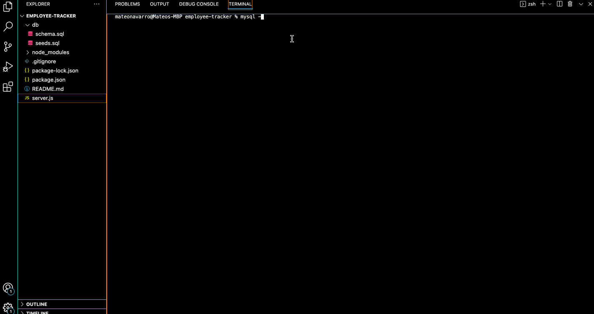

# Employee Tracker
[](https://opensource.org/licenses/MIT)

## Description 
An employee tracking system so that business owners are able to view and manage the departments, roles, and employees in their company.

## Table of Contents
* [Installation](#installation)
* [Usage](#usage)
* [Demo](#demo)
* [Technologies Used](#technologies-used)
* [Contributors](#contributors)
* [License](#license)

## Installation
The following will be a guide about installing the application and getting it to run once completed
- Start by forking the repository 
- Next perform a npm install
```bash
npm install 
```
- Next log into Mysql
```bash
mysql -u root -p
```
- Run the schema database
```bash
SOURCE db/schema.sql
```
- Run the seeds database
```bash
SOURCE db/seeds.sql
```
- Quit mysql
```bash
quit
```
- Once completed, in the terminal start the server
```bash
npm run start
```

## Usage

- View all departments
- View all employees
- View all roles
- Add new roles to database
- Update existing users


## Demo

For video walkthrough click here: https://github.com/mateonav98/employee-tracker/blob/main/images/employee-tracker.gif



## Technologies Used
1. Javascript
2. Node.js
3. Inquirer
4. Mysql

## Contributors
* Mateo Navarro [LinkedIn](https://www.linkedin.com/in/mateonav/) | [GitHub](https://github.com/mateonav98)

## MIT License

Copyright (c) 2022 Mateo Navarro

Permission is hereby granted, free of charge, to any person obtaining a copy
of this software and associated documentation files (the "Software"), to deal
in the Software without restriction, including without limitation the rights
to use, copy, modify, merge, publish, distribute, sublicense, and/or sell
copies of the Software, and to permit persons to whom the Software is
furnished to do so, subject to the following conditions:

The above copyright notice and this permission notice shall be included in all
copies or substantial portions of the Software.

THE SOFTWARE IS PROVIDED "AS IS", WITHOUT WARRANTY OF ANY KIND, EXPRESS OR
IMPLIED, INCLUDING BUT NOT LIMITED TO THE WARRANTIES OF MERCHANTABILITY,
FITNESS FOR A PARTICULAR PURPOSE AND NONINFRINGEMENT. IN NO EVENT SHALL THE
AUTHORS OR COPYRIGHT HOLDERS BE LIABLE FOR ANY CLAIM, DAMAGES OR OTHER
LIABILITY, WHETHER IN AN ACTION OF CONTRACT, TORT OR OTHERWISE, ARISING FROM,
OUT OF OR IN CONNECTION WITH THE SOFTWARE OR THE USE OR OTHER DEALINGS IN THE
SOFTWARE.
